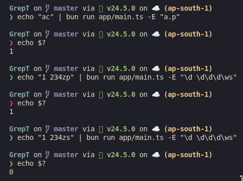

# GrepT : Grep implementation in TypeScript



Currently it supports 
- \d
- \w
- \d \d\d\d\ws
- a.b
- a+b
- a?b
- $
- [^abc]
- [^abc$]

**NOTE**
Working on more support and code cleanup to make things reusable.

### Development setup
```bash
git clone https://github.com/bandhan-majumder/GrepT
cd GrepT
bun install
```

To run:

Pass the pattern with `-E` argument as shown the image above. Try these examples;
```
echo "abb" | bun run app/main.ts -E "a.b"
echo "abc" bun run app/main.ts -E "a.b"
echo "abb" | bun run app/main.ts -E "a+c"
echo "abb" | bun run app/main.ts -E "a+b"
```